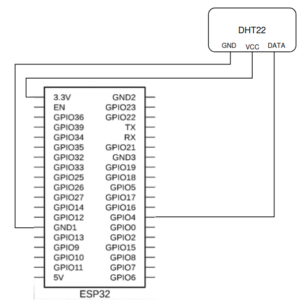
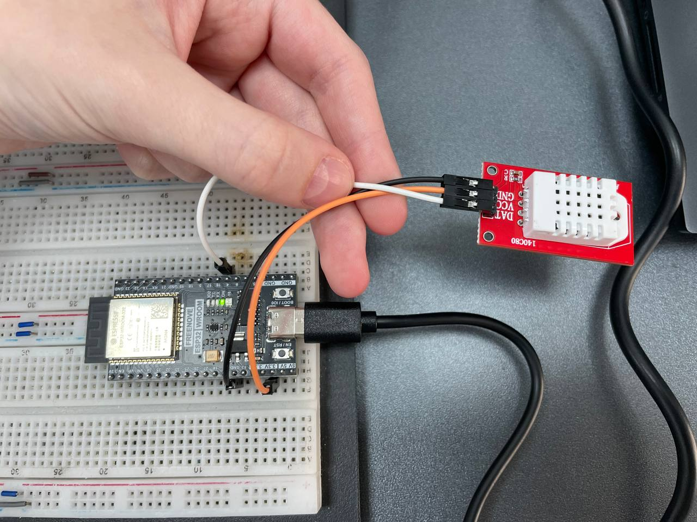
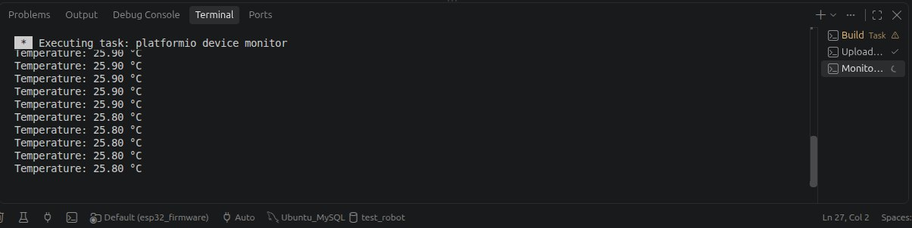
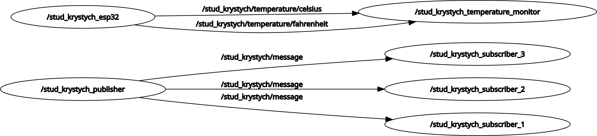
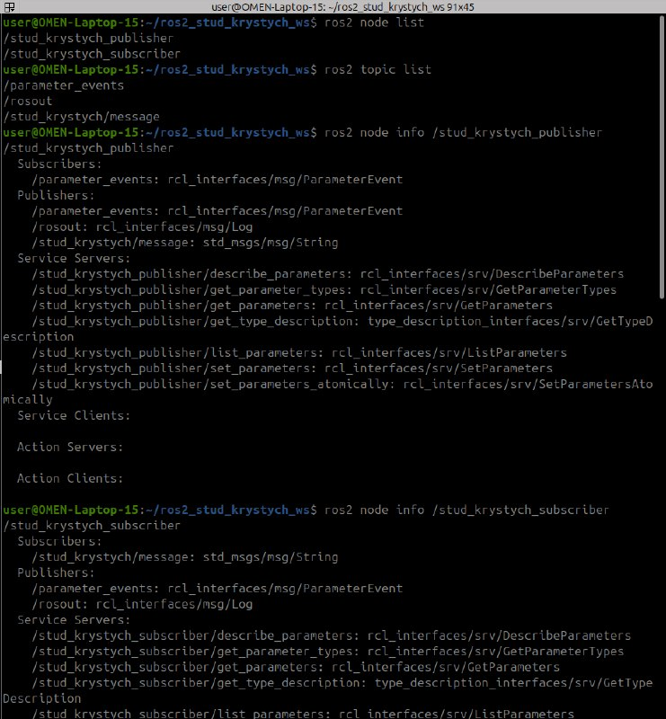
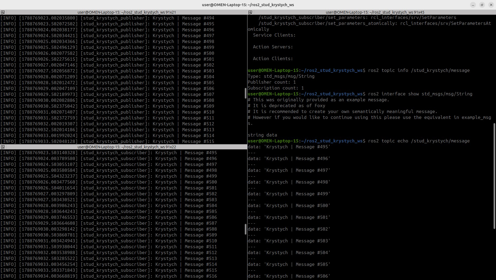
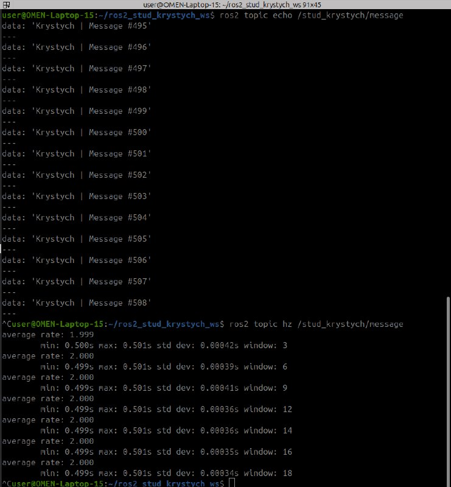
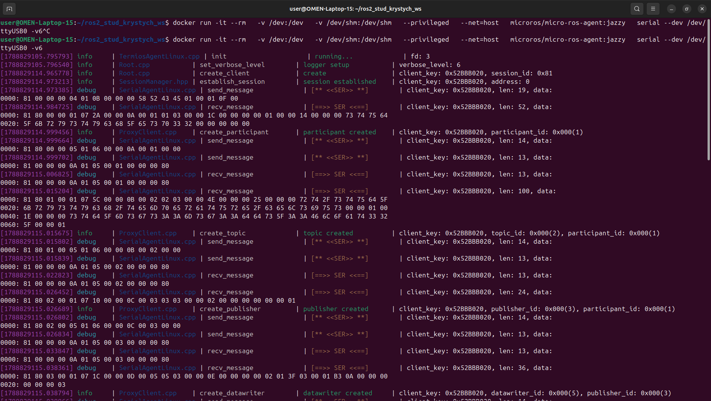

# Самостійна робота 1. Workspace, ООП-nodes та ESP32 через micro-ROS

**Виконала:** Кристич Анна, група РТ-3

## Структура репозиторію

```text
ros2_stud_krystych_ws/
├── src/
│   ├── stud_krystych_cpp_pkg/
│   │   ├── include/
│   │   │   └── stud_krystych_cpp_pkg/
│   │   │       └── student_publisher.hpp
│   │   ├── src/
│   │   │   ├── student_publisher.cpp
│   │   │   └── main.cpp
│   │   ├── CMakeLists.txt
│   │   └── package.xml
│   │
│   ├── stud_krystych_py_pkg/
│   │   ├── stud_krystych_py_pkg/
│   │   │   ├── __init__.py
│   │   │   ├── student_subscriber.py
│   │   │   └── temperature_monitor.py
│   │   ├── resource/
│   │   ├── setup.py
│   │   ├── setup.cfg
│   │   └── package.xml
│   │
│   └── esp32_firmware/
│       код мікроконтролера
│
├── docs/
│   screenshots
│   фото схеми підключення
│
├── README.md
└── .gitignore
```
## Схема системи

```text
                ROS 2 Publisher
                      │
                      │ /stud_krystych/message
                      ▼
        ┌─────────────┼─────────────┐
        ▼             ▼             ▼
   Subscriber 1  Subscriber 2  Subscriber 3


DHT22 → ESP32 → micro-ROS Agent → ROS 2
                         │
                         ├── /stud_krystych/temperature/celsius
                         └── /stud_krystych/temperature/fahrenheit
                                      │
                                      ▼
                              Temperature Monitor
```
## Опис пакетів і прошивки

**stud_krystych_cpp_pkg:** C++ пакет, який містить вузол stud_krystych_publisher. Він генерує текстові повідомлення з лічильником із частотою 2 Гц.  
**stud_krystych_py_pkg:** Python пакет, що містить вузол stud_krystych_subscriber (який можна запускати в кількох екземплярах) та вузол stud_krystych_temperature_monitor для паралельного читання двох топіків з температурою.  
**esp32_firmware:** Проєкт PlatformIO (C++) для мікроконтролера ESP32. Зчитує дані з датчика DHT22 і публікує їх у два ROS-topics за допомогою клієнта rclc через протокол micro-ROS. 

## Таблиця класів
 
| Клас | Батьківський | Поля | Методи |
|---|---|---|---|
| `StudentPublisher` | `rclcpp::Node` | `publisher_`, `timer_`, `counter_` | `timer_callback()` |
| `StudentSubscriber` | `Node` | `subscription` | `listener_callback()` |
| `TemperatureMonitor` | `Node` | `subscription_celsius`, `subscription_fahrenheit`, `last_celsius`, `last_fahrenheit` | `celsius_callback()`, `fahrenheit_callback()`, `print_temperature()` |

## Списки nodes і topics

### Nodes:
    - /stud_krystych_publisher
    - /stud_krystych_subscriber_1
    - /stud_krystych_subscriber_2
    - /stud_krystych_subscriber_3
    - /stud_krystych_esp32
    - /stud_krystych_temperature_monitor

### Topics:
    - /stud_krystych/message (std_msgs/msg/String)
    - /stud_krystych/temperature/celsius (std_msgs/msg/Float32)
    - /stud_krystych/temperature/fahrenheit (std_msgs/msg/Float32)

## Команди збірки та запуску
 
### Збірка
 
```bash
source /opt/ros/jazzy/setup.bash
cd ~/ros2_stud_krystych_ws
colcon build
source install/setup.bash
```
 
### ROS 2 nodes
 
```bash
ros2 run stud_krystych_cpp_pkg stud_krystych_publisher
ros2 run stud_krystych_py_pkg stud_krystych_subscriber --ros-args -r __node:=stud_krystych_subscriber_1
ros2 run stud_krystych_py_pkg stud_krystych_subscriber --ros-args -r __node:=stud_krystych_subscriber_2
ros2 run stud_krystych_py_pkg stud_krystych_subscriber --ros-args -r __node:=stud_krystych_subscriber_3
ros2 run stud_krystych_py_pkg stud_krystych_temperature_monitor
```
 
### micro-ROS Agent
 
```bash
docker run -it --rm   -v /dev:/dev   -v /dev/shm:/dev/shm   --privileged   --net=host   microros/micro-ros-agent:jazzy   serial --dev /dev/ttyUSB0 -v6
```
## Опис датчика і схема підключення

| Модель | DHT22 |
|---|---|
| Живлення | 3.3–5.5 В, споживання ~1.5 мА |
| Інтерфейс | OneWire, цифровий |
| Діапазон | -40...+80 °C |
| Точність | похибка ±0.5 °C |
| Роздільна здатність | 0.1 °C |
| Підключення | VCC → 3.3V, GND → GND, DATA → GPIO4 |







## Скріншоти rqt_graph

До підключення ESP32: 


Повний граф із підключеною ESP32 та монітором температури: 


## Відповіді на пункти «У звіті»
 
### Етап 1. Workspace
 
Вивід `printenv | grep ROS` та `echo $AMENT_PREFIX_PATH`:
 


> **Примітка:** на цьому етапі `AMENT_PREFIX_PATH` містив лише шлях до системного ROS 2. Шлях до власного workspace з'являється після створення та збірки пакета в workspace. Тому до створення першого пакета наявність лише одного шляху є нормальною.

 
Таблиця каталогів:
 
| Каталог | Призначення |
|---|---|
| `src` | вихідний код пакетів |
| `build` | проміжні файли збірки (CMake/colcon) |
| `install` | зібрані виконувані файли та скрипти `setup.bash` для підключення overlay |
| `log` | логи кожного запуску `colcon build` |

**Чому install/setup.bash підключається після /opt/ros/jazzy/setup.bash?**
install/setup.bash власного workspace підключається після /opt/ros/jazzy/setup.bash, оскільки власний workspace працює як overlay поверх базового середовища ROS 2 Jazzy. Він використовує системні пакети та залежності ROS 2, а також додає власні пакети та шляхи. Тому підключення workspace не замінює системне середовище ROS 2, а доповнює його.

### Етап 5. Дослідження системи через ROS 2 CLI

Команди, які було використано:
1. ros2 node list
2. ros2 topic list
3. ros2 node info /stud_krystych_publisher 
   ros2 node info /stud_krystych_subscriber
4. ros2 topic info /stud_krystych/message
5. ros2 interface show std_msgs/msg/String
6. ros2 topic echo /stud_krystych/message
7. ros2 topic hz /stud_krystych/message







Фактична частота публікації становила близько 2 Гц, що відповідає заданому в Publisher періоду таймера 500 мс. Вимірюване значення коливалося в межах незначної похибки (1.999–2.000 Гц), тому коригування програми не потребувалося.

### Етап 6. Три Subscribers з одного класу

Один Publisher публікує повідомлення в topic /stud_krystych/message лише один раз. Оскільки три nodes підписані на цей самий topic і використовують однаковий тип повідомлення std_msgs/msg/String, ROS 2 доставляє кожне опубліковане повідомлення всім трьом Subscribers. Тому кожен Subscriber отримує власну копію одного й того самого повідомлення, але Publisher не виконує publish() тричі — повідомлення публікується лише один раз. У даному випадку використання Service було б доцільним, якби замість потоку повідомлень потрібна була взаємодія за схемою «запит–відповідь».

### Етап 7. rqt та rqt_graph

За допомогою `rqt_graph` перевірено взаємодію publisher і трьох subscribers через topic `/stud_krystych/message`.

Початковий стан:


Після зупинки `subscriber_3` з графа зникли його node та з'єднання, але topic залишився, оскільки його використовують інші nodes.


Після зупинки publisher зникли його node та з'єднання, а topic також перестав відображатися, оскільки більше не залишилося publisher цього topic.


Після повторного запуску nodes їхні з'єднання відновилися.


### Етап 9. Інтеграція ESP32 через micro-ROS

**Яку роль виконує micro-ROS Agent і чому без нього ESP32 не з'являється в графі?** 
Agent — це міст між платою і звичайним ROS 2: він приймає компактні пакети протоколу Micro XRCE-DDS від ESP32 через USB/UART, розпаковує їх і публікує вже як звичайні DDS-повідомлення. Без Agent плата фізично не має способу потрапити в DDS-мережу ROS 2 — на мікроконтролері немає ресурсів для повноцінної реалізації DDS, тому весь "важкий" бік протоколу винесено на комп'ютер.
 
**Чому на мікроконтролері використовується `rclc`, а не `rclcpp`?** 
`rclcpp` — це C++ API з динамічною алокацією пам'яті (`shared_ptr`, STL-контейнери), розрахований на комп'ютери з операційною системою й достатньою кількістю RAM. `rclc` — це легша C-бібліотека зі статичною алокацією пам'яті, яка вкладається в обмежені ресурси мікроконтролера.
 
**Через яку саме ланку дані потрапляють у DDS?** 
Дані йдуть з коду ESP32 → через клієнтську бібліотеку `micro_ros_platformio` (яка реалізує Micro XRCE-DDS Client) → по USB як серіалізовані пакети → в micro-ROS Agent, який виступає Micro XRCE-DDS Agent і саме він публікує дані вже в справжній DDS ROS 2.
 
Команда запуску Agent:
```bash
docker run -it --rm   -v /dev:/dev   -v /dev/shm:/dev/shm   --privileged   --net=host   microros/micro-ros-agent:jazzy   serial --dev /dev/ttyUSB0 -v6
```

Вивід команди:


### Етап 10. Публікація температури
 
| Topic | Тип | Publishers | Subscribers | Частота | Значення |
|---|---|---|---|---|---|
| `/stud_krystych/temperature/celsius` | `std_msgs/msg/Float32` | 1 | 0 | 1.000 Гц | ~25.1–27.8 °C |
| `/stud_krystych/temperature/fahrenheit` | `std_msgs/msg/Float32` | 1 | 0 | 1.000 Гц | ~79.0–82.0 °F |

### Етап 12. Повна система та фізичний експеримент

Скріншот повного графа:


Датчик утримувався пальцями приблизно 30 секунд, після чого контакт було припинено. Значення температури фіксувалися приблизно кожні 10–15 с через складність одночасного спостереження за показами та їх запису. Між окремими вимірюваннями температура іноді не змінювалася.

| Час | Температура |
|---:|---:|
| 0 с | 25.0 °C |
| 10 с | 25.5 °C |
| 20 с | 25.9 °C |
| 30 с | 26.5 °C |
| 45 с | 26.2 °C |
| 60 с | 26.1 °C |

Температура зростала поступово, оскільки тепло передавалося від пальців до датчика не миттєво. Після відпускання датчик поступово охолоджувався до температури навколишнього середовища.

Після відпускання спад був повільнішим, оскільки тепло відводилося через повітря, а не безпосередньо через контакт із пальцями. Невеликі коливання виникають через похибку датчика та зміни умов вимірювання.

Публікувати температуру з частотою 1000 Гц недоцільно, оскільки DHT22 оновлює вимірювання значно повільніше. Більшість таких повідомлень містила б не нові вимірювання, а повторення старих значень, при цьому даремно витрачалися б ресурси ESP32, каналу зв'язку, Agent та ROS 2.

### Висновки

У роботі було створено ROS 2 workspace, C++ та Python packages, реалізовано Publisher і три Subscribers на основі одного класу, а також Temperature Monitor. ESP32 із DHT22 успішно підключено до ROS 2 через micro-ROS Agent. Температура публікується у °C та °F з частотою 1 Гц.
Під час виконання роботи виникали проблеми, пов'язані з налаштуванням середовища та підключенням ESP32 до micro-ROS Agent. Зокрема, для роботи Agent було налаштовано доступ Docker до послідовного пристрою /dev/ttyUSB0. Після налаштування доступу та запуску Agent ESP32 успішно з'явилася у графі ROS 2.